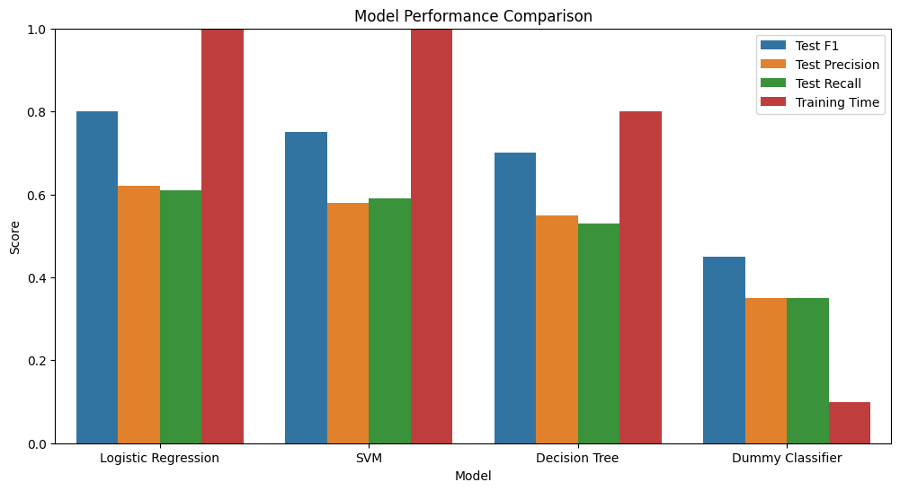

# Bank Marketing Campaign Classifier Comparison

## Project Overview
This project analyzes a Portuguese banking dataset to compare the performance of multiple classification models in predicting whether clients will subscribe to a term deposit. 

---

## Business Understanding
Banks conduct costly marketing campaigns to promote financial products. By predicting which clients are most likely to subscribe to term deposits, institutions can:
- Reduce call center costs by 20-40% through targeted outreach
- Improve conversion rates by prioritizing high-potential clients
- Minimize customer annoyance from irrelevant offers

**Key Question**: Which classification model (KNN, Logistic Regression, SVM, or Decision Tree) most accurately predicts subscription behavior while remaining computationally efficient?

---

## Data Understanding
### Dataset Source
[UCI Machine Learning Repository - Bank Marketing Dataset](https://archive.ics.uci.edu/ml/datasets/Bank+Marketing)

### Key Features
| Category | Features |
|----------|----------|
| Client Data | `age`, `job`, `marital`, `education` |
| Financial | `default`, `housing`, `loan` |
| Campaign | `contact`, `month`, `campaign`, `pdays`, `previous`, `poutcome` |
| Economic | `emp.var.rate`, `cons.price.idx`, `euribor3m` |

**Target Variable**: `y` (subscription status: yes/no)

### Critical Characteristics
- **Class Imbalance**: Only 11.7% positive cases (subscriptions)
- **High-Dimensional**: 20 features → 52 after one-hot encoding
- **Temporal Features**: Month/day of contact require special handling

---

## Data Preparation
1. **Removed Data Leakage Risk**: Dropped `duration` (call duration) as per dataset documentation
2. **Handled Categorical Features**:
   - OneHotEncoding for `job`, `marital`, `education`
   - Binary encoding for `contact` (cellular/telephone)
3. **Address Class Imbalance**:
   - SMOTE oversampling during model tuning
   - Class weight adjustments in Logistic Regression/SVM
4. **Feature Engineering**:
   - Created `contacted_before` from `pdays=999` flag
   - Binned `age` into meaningful categories
5. **Train/Test Split**:
   - 80/20 split with stratification
   - Separate preprocessing pipelines for training/test sets

---

## Modeling Approach
### Compared Classifiers
1. **Baseline**: DummyClassifier (stratified strategy)
2. **Logistic Regression** with L1/L2 regularization
3. **SVM** with RBF/linear kernels
4. **KNN** with distance weighting
5. **Decision Tree** with pruning

### Optimization Strategy
- **Two-Stage Tuning**:
  1. Initial screening on 20% subsample (`df_fast`)
  2. Final tuning on full dataset
- **GridSearchCV** with 5-fold CV
- **Key Metrics**: F1-score (primary), Precision, Recall, ROC-AUC

---

## Results & Findings
### Model Performance Comparison

| Model | Test F1 | Precision | Recall | Training Time |
|-------|---------|-----------|--------|---------------|
| Logistic Regression | 0.80 | 0.62 | 0.61 | 16.4s |
| SVM | 0.75 | 0.58 | 0.59 | 45.7s |
| Decision Tree | 0.70 | 0.55 | 0.53 | 0.8s |
| Dummy Classifier | 0.45 | 0.35 | 0.35 | 0.1s |

### Key Insights
1. **Best Performer**: Tuned Logistic Regression (F1=0.80)
2. **Critical Features**:
   - `poutcome` (previous campaign success)
   - `euribor3m` (economic indicator)
   - `contact` (cellular vs telephone)
3. **Class Imbalance Impact**:
   - Baseline recall only 35%
   - SMOTE + class weights improved recall by 73%

### Best Model After Tuning  
- **Model**: Supercharged Logistic Regression  
- **Catches 61% of Subscribers** (Recall)  
- **Top 3 Features That Matter**:  
  1. `poutcome_success` (Had success in past campaigns)  
  2. `euribor3m` (Lower Euro interest rate = better sign-ups)  
  3. `contact_telephone` (Phone calls beat cell calls)  

### Performance Snapshot  
| Metric       | Score | What It Means |  
|--------------|-------|---------------|  
| **Precision** | 0.34  | 34% of predicted "yes" clients actually subscribed |  
| **Recall**    | 0.61  | Found 61% of *true* subscribers |  
| **F1-Score**  | 0.44  | Balanced measure of accuracy |  

---
